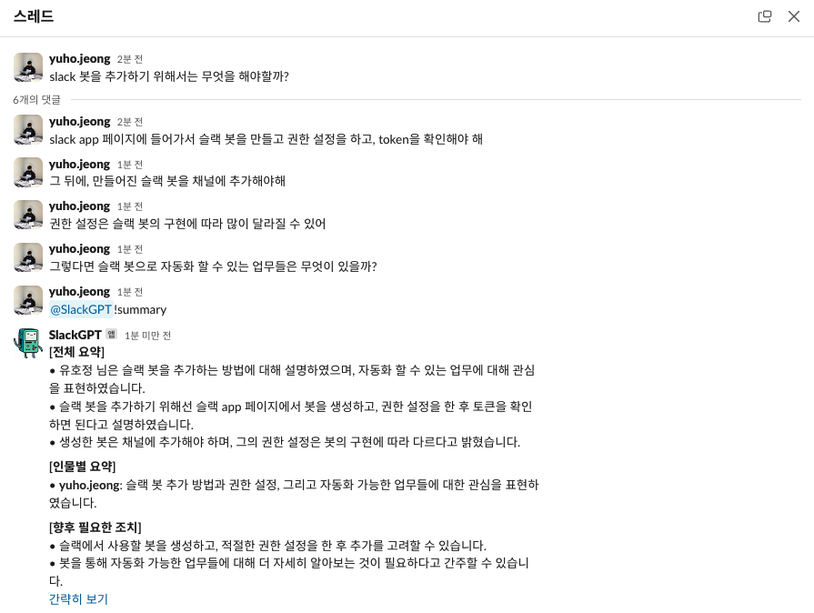

# Slack AI Bot

A slack GPT bot for summarizing conversations, creating JIRA tickets, etc.

1. Create Slack Bot

2. Set environment variables in `.env`

3. Run server with docker compose

``` sh
docker compose up -d prod --build
```

4. Set request URL to Slack Bot ([Your app](https://api.slack.com/apps) - `Event Subscriptions`)and Permission scope

5. Add the app to your channel and Request `@<app name>!summary` or `@<app name>!jira_ticket`



Please run the dev server for debugging your app

``` sh
docker compose up -d dev --build
docker attach slack_ai_dev
```

