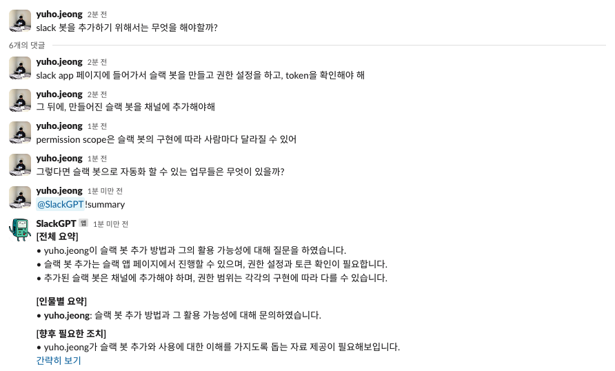
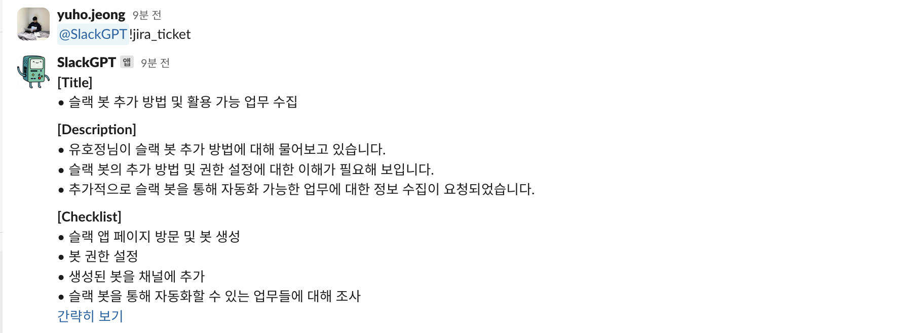
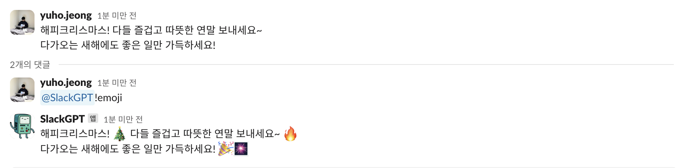

# Slack AI Bot

## Features

1. `@SlackBot` {any text}: Same as ChatGPT. But it can't remember the previous conversation.


2. `@SlackBot`!summary: Summarize the current thread conversation



3. `@SlackBot`!jira_ticket: Create a Jira ticket based on the current thread conversation



4. `@SlackBot`!emoji: Generate appropriate emojis next to the words for the Slack message



You can add your own features by making a prompt template in `slack_ai/prompts`!


## How-to-Build

A slack GPT bot for summarizing conversations, creating JIRA tickets, etc.

1. Create Slack Bot

2. Set environment variables in `.env`

3. Run server with docker compose

``` sh
docker compose up -d prod --build
```

4. Set request URL to Slack Bot ([Your app](https://api.slack.com/apps) - `Event Subscriptions`)and Permission scope

5. Add the app to your channel

Please run the dev server for debugging your app

``` sh
docker compose up -d dev --build
docker attach slack_ai_dev
```
